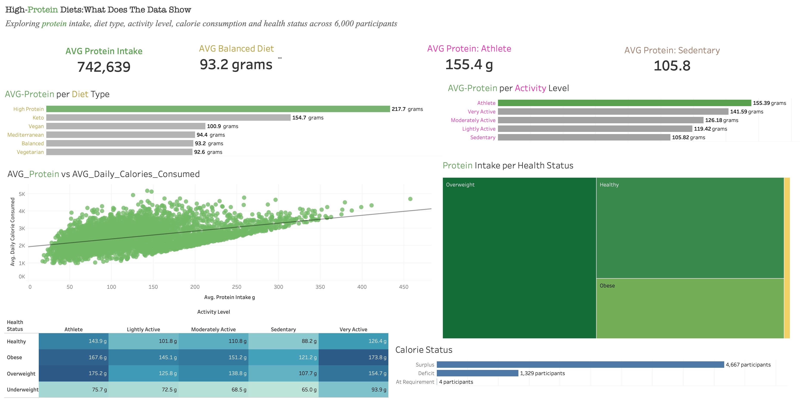

# High-Protein-Data-Analysis

## Project Overview

End-to-end data analysis exploring protein intake, diet, activity, calorie consumption and health indicators using PostgreSQL, Tableau and R.

## Motivation

The growing emphasis on high-protein diets in fitness and nutrition discussions made me curious about what the data actually shows. Rather than relying on general claims about the benefits of high-protein eating, I wanted to investigate whether higher protein intake was associated with differences in diet type, activity level, calorie consumption, and health indicators.
Using a dataset of 6,000 participants, I used PostgreSQL to clean and explore the data, Tableau to visualize the patterns, and R to investigate the relationship between protein intake and calorie consumption through multivariable regression.
The goal was not to prove whether high-protein diets are inherently better or worse, but to use data to identify patterns, test relationships, and understand what the dataset could—and could not—tell us about higher protein intake.

## Research Questions

1. How does protein intake vary across diet types?
2. How does protein intake vary across activity levels?
3. Does protein intake differ across gender groups?
4. Is higher protein intake associated with higher calorie consumption?
5. How does protein intake vary across health-status groups?
6. Does the relationship between protein intake and calorie consumption remain after controlling for other participant characteristics?

## Dataset

The dataset contains information on 6,000 participants and includes demographic, dietary, activity, calorie, hydration, BMI, and health-status variables.

Key variables used in the analysis include:

- Age and gender
- Height and weight
- BMI and health status
- Activity level
- Daily calorie requirement and calorie consumption
- Protein, carbohydrate, and fat intake
- Water intake
- Diet type

The analysis focused primarily on protein intake and its relationship with diet type, activity level, calorie consumption, BMI, and health status.

## Tools Used

- **PostgreSQL / DBeaver** — Data cleaning, validation, exploratory analysis, aggregations, CTEs, subqueries, and window functions
- **Tableau** — Data visualization and dashboard development
- **R** — Statistical analysis and multivariable linear regression
- **GitHub** — Project documentation and portfolio presentation

## Data Preparation

Before conducting the analysis, I performed a series of data-quality checks in PostgreSQL.

The process included:

- Inspecting the dataset structure and record count
- Checking for duplicate participant IDs
- Checking for missing or invalid values
- Identifying negative carbohydrate-intake values
- Checking numeric fields such as age, BMI, height, weight, and water intake for impossible values
- Checking calorie consumption against daily calorie requirements
- Creating a calorie difference variable to compare calories consumed with calorie requirements
- Classifying participants into calorie surplus, deficit, or at-requirement categories

The cleaned dataset was then used as the basis for the analysis and visualizations.

## SQL Analysis

PostgreSQL was used to conduct the initial exploratory and descriptive analysis.

The analysis examined:

- Participant distribution across activity levels and gender groups
- Average protein, carbohydrate, and fat intake
- Protein intake across activity levels and gender groups
- Protein intake across different diet types
- Calorie surplus, deficit, and at-requirement status
- Health-status and BMI patterns
- Diet-type distribution
- Rankings of participants by protein and water intake

The analysis also used intermediate and advanced SQL techniques including:

- Aggregations and grouping
- CASE statements
- Common Table Expressions (CTEs)
- Window functions such as RANK()
- Subqueries
- Data type conversion

## Tableau Dashboard

The Tableau dashboard was created to communicate the main patterns identified during the SQL analysis.

The dashboard focuses on:

- Protein intake by diet type
- Protein intake by activity level
- Protein intake and calorie consumption
- Protein intake across health-status groups
- Activity and health-status differences in protein intake
- Calorie balance across participants

## R Regression Analysis

The descriptive analysis identified a strong positive relationship between protein intake and activity level, as well as substantial differences in protein intake across diet types and health-status groups.

I used R to investigate whether the relationship between protein intake and daily calorie consumption remained after accounting for other participant characteristics.

A multivariable linear regression model was specified as:

Daily Calorie Consumption ~ Protein Intake + Age + Gender + Activity Level + Diet Type

The model was used to estimate the association between protein intake and daily calorie consumption while controlling for the other variables included in the model.

### Regression Result

Protein intake was positively associated with daily calorie consumption after controlling for age, gender, activity level, and diet type.

The estimated coefficient for protein intake was **7.12**, meaning that each additional gram of protein intake was associated with approximately **7.12 additional calories** of daily calorie consumption, holding the other variables constant.

The model had an **R² of 0.724**, indicating that approximately 72.4% of the variation in daily calorie consumption was explained by the variables included in the model.

The overall regression model was statistically significant (**p < 0.001**).

## Key Findings

### 1. Protein intake varied substantially by diet type

Participants following a **High Protein** diet had the highest average protein intake at **217.73 g**, compared with **92.60 g** among Vegetarian participants.

The average protein intake of the High Protein group was approximately 2.35 times that of the Vegetarian group.

### 2. Protein intake increased with activity level

Average protein intake was highest among **Athletes (155.39 g)** and lowest among **Sedentary participants (105.82 g)**.

This represents a difference of approximately 49.57 g between the two groups.

### 3. High protein intake did not correspond to the highest calorie intake

Despite having the highest average protein intake, the High Protein diet group had an average calorie consumption of **2,479.05 kcal**, which was lower than the average calorie consumption of the other diet groups in the dataset.

### 4. Protein intake differed across health-status groups

Average protein intake was:

- Obese: **139.42 g**
- Overweight: **131.59 g**
- Healthy: **111.55 g**
- Underweight: **72.97 g**

These differences indicate an association between protein intake and health-status category, although the analysis does not establish that protein intake causes differences in health status.

### 5. Protein remained positively associated with calorie consumption in regression analysis

After controlling for age, gender, activity level, and diet type, protein intake remained positively associated with daily calorie consumption.

The estimated coefficient was **7.12** with **p < 0.001**, while the model explained approximately **72.4%** of the variation in daily calorie consumption.

## Limitations

- The analysis is based on observational data, so the results show associations rather than causal relationships.
- The dataset does not allow the analysis to establish whether higher protein intake causes changes in BMI, health status, activity level, or calorie consumption.
- The relationship between protein intake and diet type should be interpreted carefully because diet type and protein intake are closely related concepts.
- The analysis was based on the variables available in the dataset, so other factors that may influence protein intake or calorie consumption were not included.
- The regression results represent relationships within this dataset and should not automatically be generalised to the broader population.

## Future Improvements

Future versions of the project could:

- Perform additional regression diagnostics and multicollinearity checks
- Develop a regression model examining the relationship between protein intake and BMI
- Normalise protein intake by body weight to provide a more informative comparison across participants
- Add additional Tableau interactivity and filtering
- Investigate whether calorie balance differs systematically across activity and diet groups
- Extend the statistical analysis to explore additional relationships between nutrition, activity, BMI, and health status

## Project Files

- [SQL Analysis](High-Protein-Diet-Analysis/SQL/healthy_diet_analysis.sql)
- [Tableau Dashboard]()
- [R Regression Analysis](High-Protein-Diet-Analysis/R/protein_calories_regression.R)

